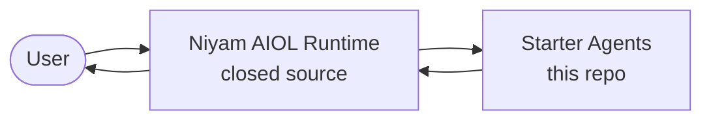

# Niyam Agent Starters

**Open-source agent SDK and starter agents for the Niyam AI Orchestration Layer (AIOL).**

[](https://github.com/Niyam-Projects/government-agent-starters/actions/workflows/ci.yml)
[](LICENSE)
[](https://www.python.org/downloads/)
[](CONTRIBUTING.md)
[](#quickstart)
[](#quickstart)

---

## What This Is

This repository contains the **open-source SDK** and **starter agents** for the **Niyam AI Orchestration Layer (AIOL)**. It provides everything you need to build, test, and contribute agents that run on the AIOL.

- **Agent SDK** — stable contracts for building agents (`AgentBase`, `AgentInput`, `AgentOutput`)
- **5 starter agents** — reference implementations inspired by government and enterprise use cases
- **Local runner** — slim, mock-only CLI for offline agent development
- **Testing utilities** — mock backends and connectors for deterministic testing

## What This Is Not

This is not the Niyam AIOL itself. The AIOL provides the security and operational infrastructure for running agents in production — it is a separate, closed-source product. Think of this repo as the **agent development kit**: everything you need to build the agents, without the machinery that secures and operates them at scale.

> **Analogy:** This repo is to the Niyam AIOL what Terraform providers are to Terraform Cloud, or what dbt models are to dbt Cloud.

---

## Who This Is For

- **Agent authors** who want to build reusable AI agent patterns.
- **Government engineering teams** prototyping AI-assisted workflows.
- **Enterprise architects** evaluating agent orchestration approaches.
- **Contributors** who want to submit agents to the Niyam ecosystem.

## What's Included

| Layer | What | Open Source |
|---|---|---|
| **SDK** | `AgentBase`, `AgentInput`, `AgentOutput`, `ModelBackend`, `Connector` protocols | Yes |
| **Starter Agents** | 5 reference starter agents (requirements, security, compliance, program, finops) | Yes |
| **Testing** | `MockBackend`, `MockConnector`, `FileConnector` | Yes |
| **Local Runner** | Slim CLI for developing/testing agents with mock backend | Yes |
| **Templates** | Scaffolding for creating new agents | Yes |
| **AIOL Security** | Production security controls for government and enterprise workloads | No — Niyam AIOL |
| **AIOL Operations** | Production model inference, enterprise integrations, workflows, deployment | No — Niyam AIOL |

---

## Demo

A quick look at the `program_support_agent` generating program management artifacts:

<video src="https://github.com/Niyam-Projects/government-agent-starters/raw/main/docs/videos/program_support_agent.mp4" controls width="100%"></video>

> If the video doesn't play inline, [watch it here](docs/videos/program_support_agent.mp4).

---

## Quickstart

### Prerequisites

- **Python 3.11+**
- **[uv](https://docs.astral.sh/uv/)** (recommended) or pip

### Install and Run

```bash
# Clone
git clone https://github.com/Niyam-Projects/government-agent-starters.git
cd government-agent-starters

# Install uv if you don't have it
curl -LsSf https://astral.sh/uv/install.sh | sh

# Install
uv pip install -e ".[dev]"

# List agents
niyam list-agents

# Run an agent with sample input (mock backend — works offline)
niyam run requirements_architect_agent \
  --input agents/requirements_architect_agent/examples/input.json
```

No API keys. No internet. No configuration. The mock backend works out of the box.

---

## CLI Reference

```bash
# List all agents
niyam list-agents

# Run an agent with a file input
niyam run <agent_name> --input path/to/input.json

# Run an agent with inline JSON
niyam run <agent_name> --payload '{"key": "value"}'

# Save output to file
niyam run <agent_name> --input input.json --output results.json

# Show local runner config
niyam info

# Show version
niyam --version
```

> **Note:** The local runner always uses the mock backend. For live model inference, security enforcement, and production operations, deploy agents via the Niyam AIOL.

---

## Architecture

```
┌─────────────────────────────────────────────────────────────────────┐
│                    THIS REPO (open source)                          │
│                                                                     │
│  ┌──────────────────────────────────────────────────────────────┐   │
│  │                      Agent SDK                               │   │
│  │   AgentBase · AgentInput · AgentOutput                       │   │
│  │   ModelBackend protocol · Connector protocol                 │   │
│  └──────────────────────────────────────────────────────────────┘   │
│                              ▲                                      │
│               agents implement this contract                        │
│                              │                                      │
│  ┌──────────┬──────────┬──────────┬──────────┬──────────────────┐   │
│  │ Require- │ Secure   │ Compli-  │ Program  │ FinOps           │   │
│  │ ments    │ Code     │ ance     │ Support  │ Review           │   │
│  │ Architect│ Agent    │ Audit    │ Agent    │ Agent            │   │
│  └──────────┴──────────┴──────────┴──────────┴──────────────────┘   │
│                                                                     │
│  ┌─────────────────────┐  ┌─────────────────────────────────────┐   │
│  │   Local Runner       │  │   Testing Utilities                │   │
│  │   (slim CLI,         │  │   MockBackend, MockConnector       │   │
│  │    mock backend)     │  │   FileConnector                    │   │
│  └─────────────────────┘  └─────────────────────────────────────┘   │
└─────────────────────────────────────────────────────────────────────┘

┌─────────────────────────────────────────────────────────────────────┐
│              NIYAM AIOL — AI Orchestration Layer (closed source)     │
│                                                                     │
│  ┌──────────────────────────────────────────────────────────────┐   │
│  │   Security Layer                                              │   │
│  │   · Identity, access control, and policy enforcement          │   │
│  │   · Prompt security and output guardrails                     │   │
│  │   · Data protection and encryption                            │   │
│  │   · Audit trail and compliance reporting                      │   │
│  │   · Secrets and credential management                         │   │
│  └──────────────────────────────────────────────────────────────┘   │
│                                                                     │
│  ┌──────────────────────────────────────────────────────────────┐   │
│  │   Operation Layer                                             │   │
│  │   · Model orchestration and backend management                │   │
│  │   · Enterprise integrations                                   │   │
│  │   · Workflow engine and agent chaining                        │   │
│  │   · Observability and monitoring                              │   │
│  │   · Deployment and environment management                     │   │
│  └──────────────────────────────────────────────────────────────┘   │
│                              │                                      │
│               AIOL loads agents via SDK contracts                    │
│                              │                                      │
│  ┌──────────────────────────────────────────────────────────────┐   │
│  │   Production Runtime                                          │   │
│  │   · Full CLI, API, and Web UI                                 │   │
│  └──────────────────────────────────────────────────────────────┘   │
└─────────────────────────────────────────────────────────────────────┘
```

### The Boundary

Agents only depend on `niyam.sdk`. They call `model_backend.generate(prompt)` and `connector.fetch(query)` without knowing what's behind them. Locally, it's the mock. In production, the AIOL injects real implementations with full security and operational capabilities.

This means **you can build and fully test agents without access to the AIOL**. When agents are deployed on the AIOL, they automatically gain production security and operations.

### Runtime Execution Flow

At runtime, the Niyam AIOL wraps every agent invocation in a security and orchestration pipeline. Agents stay focused on their task; the AIOL handles the rest.



The AIOL provides authenticated entry, policy enforcement, model inference, external system connectivity, and audit logging around each call. Specific orchestration patterns, connector implementations, and security controls are part of the closed-source AIOL product.

---

## Repository Layout

```
government-agent-starters/
├── agents/                          # Starter agent implementations
│   ├── requirements_architect_agent/
│   ├── secure_code_agent/
│   ├── compliance_audit_agent/
│   ├── program_support_agent/
│   └── finops_review_agent/
├── src/niyam/
│   ├── sdk/                         # Agent contracts (THE public API)
│   │   ├── agent.py                 #   AgentBase, AgentInput, AgentOutput
│   │   └── protocols.py             #   ModelBackend, Connector ABCs
│   ├── testing/                     # Mock implementations for offline dev
│   │   ├── backends.py              #   MockBackend
│   │   └── connectors.py            #   MockConnector, FileConnector
│   └── runner/                      # Slim local CLI (NOT the AIOL)
│       ├── cli.py                   #   Local development commands
│       ├── config.py                #   Minimal config
│       └── discovery.py             #   Agent discovery
├── tests/                           # Test suite
├── docs/                            # Documentation
├── examples/                        # Runnable examples
├── scripts/                         # Setup utilities
├── templates/new_agent/             # Scaffolding for new agents
├── .github/workflows/               # CI
├── .devcontainer/                   # VS Code dev container
└── [config files]                   # pyproject.toml, Makefile, etc.
```

Each agent directory contains:

```
agents/<agent_name>/
├── __init__.py          # Module init
├── agent.py             # Implementation (extends AgentBase)
├── config.yaml          # Agent-specific config
├── prompt.md            # Jinja2 prompt template
├── README.md            # Documentation
└── examples/
    ├── input.json       # Sample input
    └── output.json      # Expected output
```

---

## Starter Agents

| Agent | Description |
|---|---|
| `requirements_architect_agent` | Structures requirements into traceable, categorized artifacts |
| `secure_code_agent` | Generates and refactors production-grade code with built-in security, testability, and compliance |
| `compliance_audit_agent` | Evaluates artifacts against compliance frameworks (NIST, FedRAMP) |
| `program_support_agent` | Generates program management artifacts (status reports, risk registers) |
| `finops_review_agent` | Analyzes cloud spend and recommends cost optimizations |

---

## Adding a New Agent

```bash
# Copy the template
cp -r templates/new_agent agents/my_agent

# Edit the agent
# agents/my_agent/agent.py
```

```python
from niyam.sdk import AgentBase, AgentInput

class MyAgent(AgentBase):
    name = "my_agent"
    version = "0.1.0"
    description = "Does something useful."

    def _run(self, agent_input, model_backend):
        response = model_backend.generate(self.prompt_template)
        return {"result": response}
```

```bash
# Test it
niyam run my_agent --payload '{"input_text": "test"}'
```

See [docs/adding-agents.md](docs/adding-agents.md) for the full guide.

---

## Contributing

We welcome agent contributions. The open-source contribution surface is well-defined:

| Can Contribute | Cannot Contribute (Niyam AIOL) |
|---|---|
| New agents | Security layer |
| Agent improvements | Model backend implementations |
| SDK improvements (with coordination) | Enterprise integrations |
| Testing utilities | Workflow/orchestration engine |
| Documentation | Production infrastructure |
| Local runner improvements | Web UI |
| Bug fixes | |

The primary contribution path is **agents**. Build them against the SDK, test them with the mock backend, and submit a PR. See [CONTRIBUTING.md](CONTRIBUTING.md) for details.

---

## Running Tests

```bash
make test               # run all tests
make test-fast          # skip slow/integration tests
make test-cov           # with coverage report
```

## Linting and Formatting

```bash
make lint               # check for issues
make format             # auto-fix formatting
make typecheck          # mypy type checking
make audit              # dependency vulnerability audit
make check              # all quality checks
```

## Docker

```bash
make docker-build
docker run --rm niyam-agent-starters:local \
  run requirements_architect_agent \
  --payload '{"requirements_text": "The system must support SSO."}'
```

---

## Security

Security is the **top reason the AIOL is closed source**. Production security controls — including access enforcement, prompt security, data protection, audit, and compliance — are not published.

**In this repo (open-source baseline):**

- The local runner makes **zero network calls**. All model inference uses the mock backend.
- No secrets should be committed — `.env` is ignored, common credential artifacts are ignored, and pre-commit checks for private keys.
- All agent inputs are validated via Pydantic before processing.
- All agent outputs use a consistent, inspectable `AgentOutput` schema.
- The Docker image runs as a non-root user.
- No auth, no encryption, no audit trail — this is a development tool.

**On the Niyam AIOL:** The AIOL provides a comprehensive security layer purpose-built for government and enterprise AI workloads. Additional security and compliance details are handled separately from this public repository.

See [docs/security.md](docs/security.md) for the security boundary, [SECURITY.md](SECURITY.md) for vulnerability reporting, and [DISCLAIMER.md](DISCLAIMER.md) for usage disclaimers.

---

## Niyam AIOL Integration

Agents built with this SDK are loaded by the Niyam AIOL at runtime. The AIOL:

1. Enforces security policies before, during, and after agent execution.
2. Discovers agents by scanning for `AgentBase` subclasses.
3. Injects production `ModelBackend` and `Connector` implementations.
4. Wraps agent execution with security, audit, and operational capabilities.

See [docs/platform-integration.md](docs/platform-integration.md) for the integration contract.

---

## License

[Apache License 2.0](LICENSE) — build agents, ship them, extend them.

## Disclaimer

This is an open-source agent SDK. It has not been certified for any specific government system. See [DISCLAIMER.md](DISCLAIMER.md).
